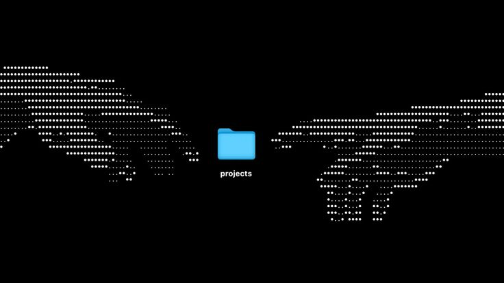

<h1 align="center">👋 Olá, é um prazer em te conhecer. Me chamo <strong>Lucas Paguetti</strong></h1>
 

Estudante da Cesar School no curso de Análise e Desenvolvimento de Sistemas. Desenvolvedor que busca solucionar problemas reais e facilitar a vida com tecnologia.

 

  
  

  <h2>🧙‍♂️ Sobre Mim</h2>
  <ul style="list-style: none; padding: 0; margin: 0; text-align: center;">
    <li style="margin: 8px 0;">🎓 Estudante de Análise e Desenvolvimento de Sistemas <strong>(ADS)</strong> na <strong>Cesar School</strong></li>
    <li style="margin: 8px 0;">💡 Apaixonado por tecnologia, automações e desenvolvimento web</li>
    <li style="margin: 8px 0;">🚀 Sempre criando e estudando novas ideias para solucionar problemas reais</li>
    <li style="margin: 8px 0;">📍 Recife, Pernambuco; <strong>Brazil</strong>🇧🇷</li>
    <li style="margin: 8px 0;"> 👊🏻 Aberto a <strong>networking</strong></li>
<li style="margin: 8px 0;"> <strong>🤖👨🏻‍🏫 Foco em desenvolvimento Backending, Automação, IA, Análise e Tratamrnto de Dados e Machine Learning</strong></li>
<li style="margin: 8px 0;"> Monitor de Projetos pela <strong> Cesar School + Porto Digital</strong> 🚢🌐</li>
  </ul>

<h2 align="center">☎️ Contato</h2>

  
  
  
  
  
  

<h2 align="center">⛏️💻 Tecnologias e Stacks Principais</h2>

  
  
  
  
  
  
  
  
  
  
  
  
  
  
  
  
  
  
  
  
  
  
  
  
  
  
  
  
  

   

<h2 align="center"> 🧰 Projetos em Destaque</h2>

1️⃣ 🎬🍿 Cinema – Sistema de Reservas em Flask   <strong>Concluido✅</strong> 

<a href="https://github.com/wqiluc/Cinema-Python-Flask">🔗Ver Projeto ==> </a>

Sistema de reservas de cinema com rotas Flask, templates, interface limpa e experiência de usuário intuitiva.

     
  
   
   
  
  
  
   
  
  
    
    

<strong>Full Stack (front e backending)</strong>

 

2️⃣ 🗑️⚙️ Lixeira Automática – Projeto da disciplina: Sistemas Digitais   <strong>Concluido✅</strong> 

<a href="https://github.com/wqiluc/Lixeira-Automa-tica-SD">🔗Ver Projeto ==> </a>

Site completo com páginas de equipe, protótipo, detalhes técnicos e FAQ.

     
   
   
    
    

 

3️⃣ 🏥🥼 Sistema CRUD Saúde   <strong>Concluido✅</strong> 

<a href="https://github.com/eduardo-scavalcanti/projetofp-crud">🔗Ver Projeto ==> </a>

Gerenciamento de pacientes, atendimentos e informações médicas por meio de operações CRUD.

     
  
  
  

<strong>Full Backending</strong>

 

4️⃣ 📚 MVP: Capacita+   <strong>Concluído</strong> ✅ 

<a href="https://github.com/viictorpaes/Capacita-Mais">🔗 Ver MVP ==> </a>

Plataforma educacional inclusiva para alunos neurodivergentes.

   
  
  
  
  
  
  
  
  
  
  
  
  
  
  
   
  
  
  

 

5️⃣ 📧🐍 Automação de E‑mails – Envio de Relatórios Automatizados   <strong>Concluído✅</strong> 

<a href="https://github.com/wqiluc/Automacao_E-mails_Python">🔗Ver Projeto ==> </a>

Aplicação em Python que automatiza o envio de e‑mails com relatórios gerenciais.

       
  
  
  
  
  
    
  

   
  
  
<strong>Full Autommation (backending)</strong>

  <strong>6️⃣ 🚀💻 Semana Jornada Python — Workshop Intensivo</strong>

<strong>Concluído ✅</strong>

<a href="https://github.com/wqiluc/Semana-Jornada-Python">🔗 Ver Catálogo ==> </a>

     
   
   
   
   
   
   
   
    
   
   
   
     
   
   
   
   
   
    
   
   
   
   

  <strong>7️⃣ 📊📲 Automação Analítica — WhatsApp com Python</strong>

<strong>Concluído ✅</strong>

<a href="https://github.com/wqiluc/Automacao-Python-Dados-Whatsapp">🔗 Ver Projeto ==> </a>

     
   
   
   
   
   
   
   
   
   
    
   
   

  <strong>8️⃣ 📊🧠 Análise Exploratória de Dados & Automação</strong>

<strong>Concluído ✅</strong>

<a href="https://github.com/wqiluc/Python-Data-Analysis-Companies">🔗 Ver Projeto ==> </a>

     
   
   
   
   
   
   
   
   
   
    
   
   

<h2 align="center">📚✅ Estudos e Certificações</h2>

 Algoritmos / Lógica de Programação — Hasgtag Treinamentos

<a href="https://github.com/wqiluc/Algortmos--Hashtag--Treinamentos">🔗Ver Repositório </a>

     

 

🔐 Segurança da Informação — Curso em Vídeo

<a href="https://github.com/wqiluc/Seguranca-da-Informacao-">🔗Ver Repositório</a>

  
    
   
  

 

🥉🏆 Projeto - Porto Digital: Capacita+

<a href="https://github.com/wqiluc/Certificado-PortoDigital-CapacitaMais">🔗Ver Repositório </a>

  
  
  
  

 

 🐬📊 SQL Impressionador — Hashtag Treinamentos

<a href="https://github.com/wqiluc/SQL_Impressionador_HashtagTreinamentos">🔗 Ver Repositório</a>

     
  
  
  
    
  
  

 

 ⚙️🧭 Estudos em C — Repositório de Estudos

<a href="https://github.com/wqiluc/Repositorio-de-Estudos-em-C">🔗 Ver Repositório</a>

   
  
  
  
  
  
   
  
  

<h2 align="center">🚀 Vamos nos conectar?</h2>
 

Se quiser trocar ideias sobre projetos, estudos, dúvidas ou tecnologia,  
fique à vontade para entrar em contato 👋

  

 
