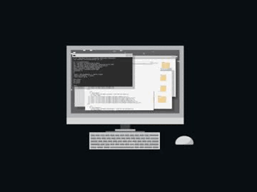

  

<h1 align="center">👋 Olá, é um prazer em te conhecer. Me chamo <strong>Lucas Paguetti</strong></h1>
 

Estudante da Cesar School no curso de Análise e Desenvolvimento de Sistemas. Desenvolvedor que busca solucionar problemas reais e facilitar a vida com tecnologia.

 

  
  

  

 

  <h2>🧙‍♂️ Sobre Mim</h2>
  <ul style="list-style: none; padding: 0; margin: 0; text-align: center;">
    <li style="margin: 8px 0;">🎓 Estudante de Análise e Desenvolvimento de Sistemas <strong>(ADS)</strong> na <strong>Cesar School</strong></li>
    <li style="margin: 8px 0;">💡 Apaixonado por tecnologia, automações e desenvolvimento web</li>
    <li style="margin: 8px 0;">🚀 Sempre criando novos projetos para solucionar problemas reais</li>
    <li style="margin: 8px 0;">📍 Recife, Pernambuco; <strong>Brazil</strong>🇧🇷</li>
    <li style="margin: 8px 0;">🌐 Aberto a <strong>networking</strong></li>
<li style="margin: 8px 0;"> <strong>🤖👨🏻‍🏫 Foco em desenvolvimento Backending, Automação, IA, Análise e Tratamrnto de Dados e Machine Learning</strong></li>
  </ul>

 

<h2 align="center">☎️ Contato</h2>
 

  
  
  
  
  

 

<h2 align="center">⛏️💻 Tecnologias e Stacks Principais</h2>

  
  
  
  
  
  
  
  
  
  
  
  
  
  
  
  
  
  
  
  
  
  
  
  
  

 

<h2 align="center"> 🧰 Projetos em Destaque</h2>
 

1️⃣ 🎬🍿 Cinema – Sistema de Reservas em Flask   Concluido✅ 

<a href="https://github.com/wqiluc/Cinema-Python-Flask">🔗Ver Projeto ==> </a>

Sistema de reservas de cinema com rotas Flask, templates, interface limpa e experiência de usuário intuitiva.

     
  
   
   
  
  
  
   
  
  
    
    

<strong>Full Stack (front e backending)</strong>

 

2️⃣ 🗑️⚙️ Lixeira Automática – Projeto da disciplina: Sistemas Digitais   Concluido✅ 

<a href="https://github.com/wqiluc/Lixeira-Automa-tica-SD">🔗Ver Projeto ==> </a>

Site completo com páginas de equipe, protótipo, detalhes técnicos e FAQ.

     
   
   
    
    

 

3️⃣ 🏥🥼 Sistema CRUD Saúde   Concluido✅ 

<a href="https://github.com/eduardo-scavalcanti/projetofp-crud">🔗Ver Projeto ==> </a>

Gerenciamento de pacientes, atendimentos e informações médicas por meio de operações CRUD.

     
  
  
  

<strong>Full Backending</strong>

 

4️⃣ 📧🐍 Automação de E‑mails – Envio de Relatórios Automatizados   Concluído✅ 

<a href="https://github.com/wqiluc/Automacao_E-mails_Python">🔗Ver Projeto ==> </a>

Aplicação em Python que automatiza o envio de e‑mails com relatórios gerenciais, integrando com planilhas Excel e preenchendo o conteúdo de forma automática. 📧🐼🐍</  
  

       
  
  
  
  
  
    
  

   
  
  
<strong>Full Autommation (backending)</strong>

  <strong>5️⃣ 🚀💻 Semana Jornada Python — Workshop Intensivo em Python pela Hashtag Treinamentos</strong>

  <strong>Concluído ✅</strong>

  <a href="https://github.com/wqiluc/Semana-Jornada-Python">🔗 Ver Catálogo ==> </a>

Durante a <strong>Semana Jornada Python</strong> da <strong>Hashtag Treinamentos</strong>, foram realizados <strong>workshops práticos e desafios diários</strong> que abordaram diferentes áreas de Python, incluindo:  
<ul align="center">
  <li>Automação de processos e integração com planilhas CSV;</li>
  <li>Análise de dados e geração de insights estratégicos;</li>
  <li>Criação de modelos de Machine Learning e previsão de resultados;</li>
  <li>Desenvolvimento de aplicações interativas com Streamlit e integração com OpenAI;</li>
</ul>
Foram aplicados os conceitos aprendidos nos <strong>Projetos 1 a 4</strong>, consolidando habilidades em Python e ferramentas complementares.  

     
   
   
   
   
   
   
   
    
   
   
   
     
   
   
   
   
   
    
   
   
   
   

  <strong>6️⃣ 📊📲 Automação Analítica — WhatsApp com Python e Análise Estratégica de Clientes</strong>

  <strong>Concluído ✅</strong>

  <a href="https://github.com/wqiluc/Automacao-Python-Dados-Whatsapp">🔗 Ver Projeto ==> </a>

Neste projeto foi desenvolvida uma <strong>automação analítica completa</strong>, focada na <strong>análise estratégica de bases de clientes</strong>,
tratamento de dados e <strong>envio automatizado de mensagens via WhatsApp</strong>, integrando análise de dados,
automação operacional e comunicação corporativa inteligente.   

Foram aplicadas práticas como:
<ul align="center">
  <li>Leitura e tratamento de bases CSV e Excel;</li>
  <li>Padronização e limpeza de dados para análise estratégica;</li>
  <li>Geração automática de relatórios analíticos;</li>
  <li>Automação de envio de mensagens no WhatsApp Web;</li>
  <li>Integração com área de transferência e automações de interface;</li>
  <li>Organização de projetos Python com foco em produtividade.</li>
</ul>
O projeto consolida habilidades em <strong>automação de processos, análise de dados e integração de sistemas</strong>,
criando uma base escalável para futuras automações inteligentes. 🚀

     
   
   
   
   
   
   
   
   
   
    
   
   

  <strong>7️⃣ 📊🧠 Análise Exploratória de Dados Organizacionais & Automação Analítica com Python</strong>

  <strong>Concluído ✅</strong>

  <a href="https://github.com/wqiluc/Python-Data-Analysis-Companies">🔗 Ver Projeto ==> </a>

Neste projeto foi desenvolvida uma <strong>análise exploratória completa de dados organizacionais</strong>,
integrando tratamento de dados, geração de visualizações estratégicas e
<strong>automação de envio de relatórios por e-mail</strong>.  

A aplicação realiza a limpeza da base, remoção de colunas irrelevantes,
padronização e tradução para PT-BR 🇧🇷, seguida da construção de
<strong>insights estratégicos sobre fundação das empresas, distribuição geográfica e porte organizacional</strong>.  

Além da análise, o projeto implementa <strong>automação operacional com PyAutoGUI e Pyperclip</strong>,
simulando interações no navegador para envio estruturado de relatórios,
demonstrando integração entre análise de dados e automação inteligente de processos.

Foram aplicadas práticas como:

<ul align="center">
  <li>Limpeza, padronização e tradução de bases CSV;</li>
  <li>Remoção de inconsistências e dados irrelevantes;</li>
  <li>Exploração de padrões de fundação e quantidade de funcionários;</li>
  <li>Construção de visualizações estratégicas com Plotly;</li>
  <li>Geração de relatórios automatizados por e-mail;</li>
  <li>Organização analítica em Jupyter Notebook reprodutível.</li>
</ul>

O projeto consolida competências em <strong>Análise Exploratória de Dados (EDA), visualização estratégica,
automação de tarefas repetitivas e integração entre análise e comunicação corporativa</strong>,
transformando dados brutos em informação acionável para tomada de decisão. 🚀

     
   
   
   
   
   
   
   
   
   
    
   
   

<h2 align="center">📚✅ Estudos e Certificações</h2>

 Algoritmos / Lógica de Programação — Hasgtag Treinamentos

  <a href="https://github.com/wqiluc/Algortmos--Hashtag--Treinamentos" target="_blank">🔗Ver Repositório </a>

     

 

 Algoritmos / Lógica de Programação — Curso em Vídeo

  <a href="https://github.com/wqiluc/Algori-tmos---Curso-em-Video" target="_blank">🔗Ver Repositório </a>

 

🔐 Segurança da Informação — Curso em Vídeo

  <a href="https://github.com/wqiluc/Seguranca-da-Informacao-" target="_blank">🔗Ver Repositório</a>

  
    
   
  

 

🥉🏆 Projeto - Porto Digital: Capacita+

  <a href="https://github.com/wqiluc/Certificado-PortoDigital-CapacitaMais" target="_blank">🔗Ver Repositório </a>

  
  
  
  

 

🌐 Git & GitHub — Curso em Vídeo

  <a href="https://github.com/wqiluc/Git-Github-Curso-em-Video" target="_blank">🔗Ver Repositório </a>

  
  

 

🌐 Git & GitHub — Hashtag Treinamentos

  <a href="https://github.com/wqiluc/Git-Github-Hashtagtreinamentos" target="_blank">🔗Ver Repositório </a>

  
  

🐍🌍 Mundos Python — Curso em Vídeo   (1-4)

  <a href="https://github.com/wqiluc/Mundos-Python-CursoemVideo" target="_blank">🔗Ver Repositório </a>

     
  
  
  

 

🐍🚀 Python Impressionador — Hashtag Treinamentos

  <a href="https://github.com/wqiluc/Python_Impressionador_HashtagTreinamentos" target="_blank">🔗 Ver Repositório</a>

    
  
  
  
  
  
  
  
  
  
  
  
  
  
  
  
  
  
  
   
  
  

 

 🐬📊 SQL Impressionador — Hashtag Treinamentos

  <a href="https://github.com/wqiluc/SQL_Impressionador_HashtagTreinamentos" target="_blank">🔗 Ver Repositório</a>

     
  
  
    
  
  

 

 🚀 Ciclo RiseUp — Cesar + RocketSeat + Porto Digital

  <a href="https://github.com/wqiluc/Ciclo-RiseUp-Cesar" target="_blank">🔗 Ver Repositório</a>

   
  
  
  
  
  
  
  
  
  
   
  
  

 

 ⚙️🧭 Estudos em C — Repositório de Estudos

  <a href="https://github.com/wqiluc/Repositorio-de-Estudos-em-C" target="_blank">🔗 Ver Repositório</a>

   
  
  
  
  
  
  
   
  
  

<h2 align="center">🚀 Vamos nos conectar?</h2>
 

Se quiser trocar ideias sobre projetos, estudos, dúvidas ou tecnologia,  
fique à vontade para entrar em contato 👋

  

 
