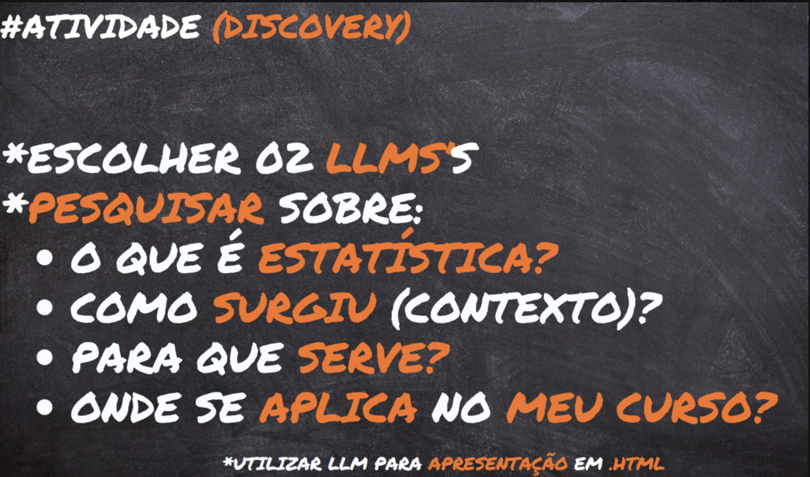
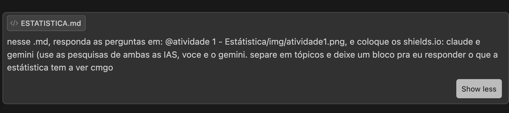
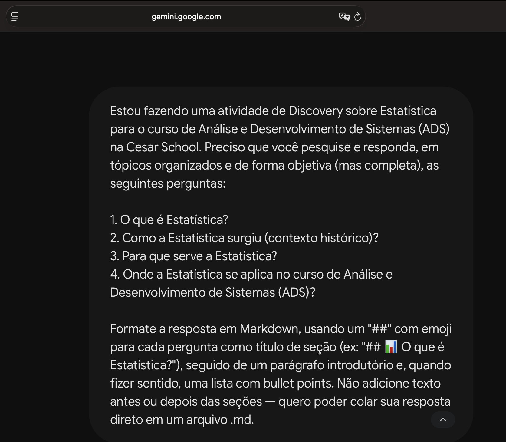

<h1 align="center"><b>Atividade 1 - O que a Estátistica tem a ver comigo?</b>  
</h1>

<h2 align="center">👨🏻‍💻 Autor deste Repositório: </h2>

<strong>Lucas Paguetti Pereira</strong> 🧙‍♂️ 
🏫 <strong>Instituição:</strong> Cesar School 🎓🧡 
📍 Recife, Pernambuco — <strong>Brazil</strong> 🇧🇷
 

<a href="https://www.linkedin.com/in/lucas-paguetti-pereira-70267339b/">
    
</a>

<h2 align="center">💻⛏️ Tecnologias e LLM's utilizadas: </h2>

  

<h2 align="center">📝 Prompts utilizados: </h2>

<h2 align="left"></h2>

<h2 align="left"></h2>

## 📊 O que é Estatística?

<h2 align="left"></h2>

Área da matemática aplicada dedicada a **coletar, organizar, analisar, interpretar e apresentar dados**, transformando grandes volumes de informação em conclusões confiáveis mesmo diante de incerteza.

- **Descritiva**: resume os dados (médias, medianas, desvio padrão, gráficos).
- **Inferencial**: usa amostras para tirar conclusões sobre uma população maior, com probabilidade.

<h2 align="left"></h2>

Ciência que coleta, organiza, analisa, interpreta e apresenta dados para apoiar decisões sob incerteza, transformando números brutos em informações úteis.

- **Coleta e Organização**: estruturação de dados brutos.
- **Análise Descritiva**: média, mediana, variância, desvio padrão.
- **Inferência**: generaliza amostras para populações, com margem de erro.
- **Modelagem e Predição**: modelos probabilísticos para antecipar tendências.

> 🔎 **Comparando**: ambas convergem na definição central e na divisão descritiva/inferencial; o Gemini já cita modelagem preditiva, o Claude é mais enxuto.

## 📜 Como surgiu a Estatística? (Contexto)

<h2 align="left"></h2>

Vem do latim *status* (Estado): raízes ligadas a censos, recursos militares e impostos no Egito, China e Roma antigos.

- **Séc. XVII**: Graunt e Petty criam a "aritmética política" (registros de nascimentos/mortes).
- **Séc. XVIII-XIX**: Gauss, Laplace e Pascal formalizam a teoria das probabilidades.
- **Séc. XX**: Fisher e Pearson consolidam testes de hipótese e Estatística Inferencial.

<h2 align="left"></h2>

Raízes na Antiguidade, ligada ao termo "Estado": governantes recenseavam população e riquezas para tributação e recrutamento militar.

- **Antiguidade**: censos egípcios, babilônios, chineses e romanos.
- **Séc. XVII**: Graunt (mortalidade); Pascal e Fermat formalizam a Probabilidade.
- **Séc. XVIII-XIX**: Gauss cria a Distribuição Normal; Quetelet aplica às ciências sociais.
- **Séc. XX**: Fisher, Pearson e Neyman desenvolvem testes de hipótese e design de experimentos.

> 🔎 **Comparando**: mesmos marcos (Graunt, Pascal, Gauss, Fisher); Gemini organiza por século, Claude acrescenta Petty e Laplace.

---

## 🎯 Para que serve a Estatística?

<h2 align="left"></h2>

Transforma dados em decisões:

- Decisões baseadas em evidências (negócios, saúde, políticas públicas).
- Identificação de padrões e tendências.
- Previsão de cenários (demanda, risco de crédito, comportamento de usuários).
- Validação de testes A/B e estudos clínicos.
- Base para Machine Learning e IA.

<h2 align="left"></h2>

Transforma dados em conhecimento acionável, substituindo achismo por evidências:

- Fundamentação de decisões de governos e empresas.
- Identificação de padrões, anomalias e correlações.
- Mitigação de risco (investimentos, seguros, saúde, cibersegurança).
- Validação de hipóteses científicas.

> 🔎 **Comparando**: convergem em "reduzir achismo com evidências"; Claude foca em tecnologia (A/B, ML), Gemini amplia para saúde e cibersegurança.

## 🎓 Onde a Estatística se aplica no meu curso? (ADS)

<h2 align="left"></h2>

- **Análise de sistemas**: métricas de performance, uso e logs.
- **Testes de software**: amostras de teste, cobertura, frequência de bugs.
- **Machine Learning/IA**: classificação, regressão e clusterização.
- **BI**: relatórios, dashboards e KPIs.
- **Gestão ágil**: velocidade do time, burndown, previsibilidade.
- **UX/Produto**: testes A/B e análise de comportamento.

<h2 align="left"></h2>

- **Ciência de Dados/ML**: regressão, árvores de decisão, redes neurais.
- **Desempenho de software**: latência, throughput e taxa de erro via percentis.
- **Testes A/B/UX**: significância estatística entre versões.
- **BI**: dashboards e relatórios a partir de bancos SQL/NoSQL.
- **Cibersegurança**: detecção de fraudes e anomalias.

> 🔎 **Comparando**: ambas citam ML, A/B e BI; Claude inclui Gestão Ágil, Gemini traz percentis/latência e cibersegurança.

## 🤔 O que a Estatística tem a ver comigo?

> _Espaço reservado para minha resposta pessoal:_
>
> (escreva aqui a sua reflexão)
