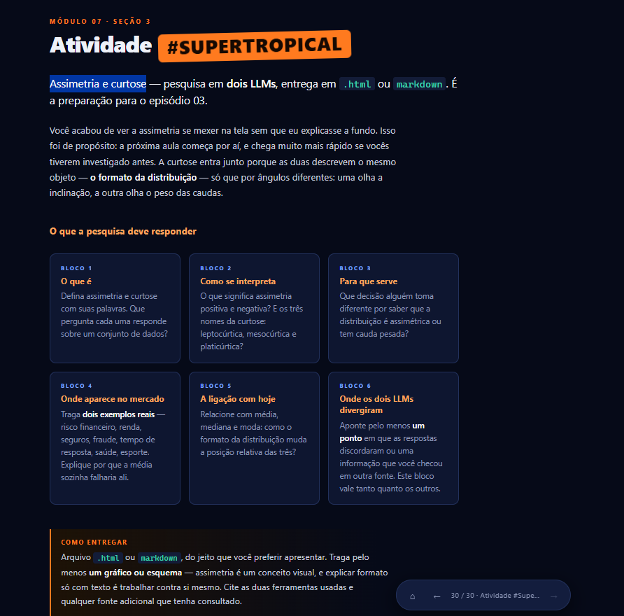
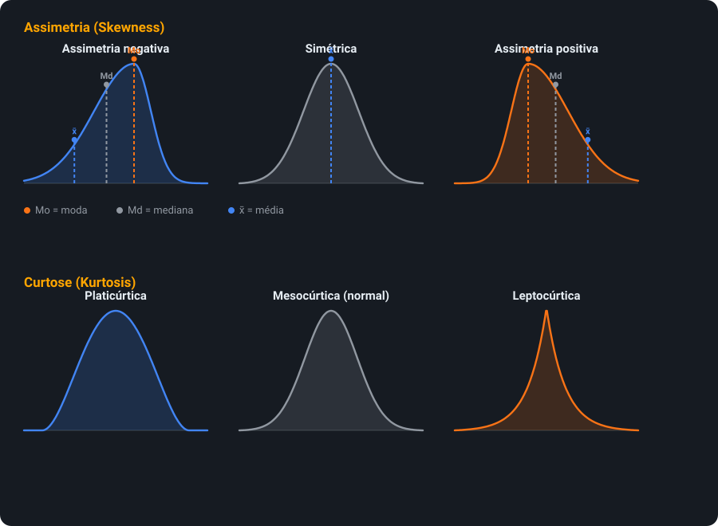
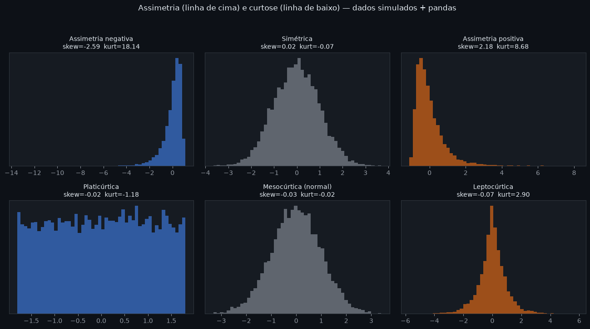
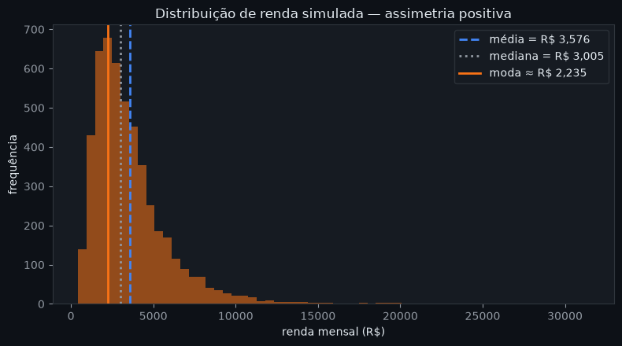
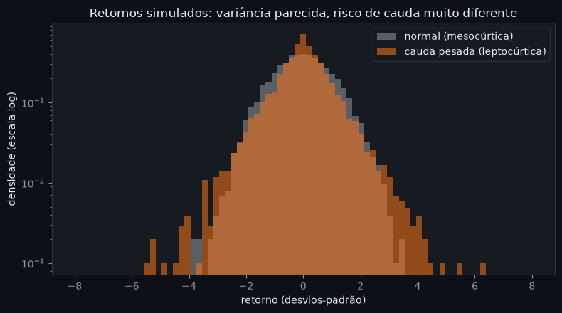
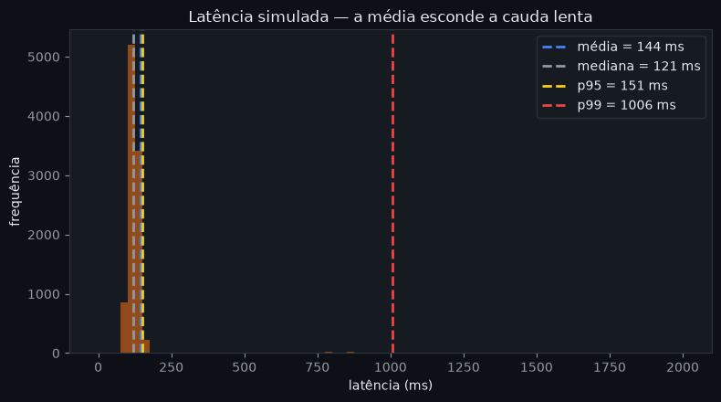

<h1 align="center">
  Cesar School —  
  Estátistica Aplicada - Atividade 2:  
  Assimetria e Curtose
</h1>

Pesquisa comparando <strong>Claude</strong> e <strong>Gemini</strong> sobre assimetria e curtose, com gráficos gerados em <code>pandas</code> + <code>matplotlib</code> exemplificando cada conceito com dados simulados.
  

<h2 align="center">👨🏻‍💻 Autor deste Repositório: </h2>

<strong>Lucas Paguetti Pereira</strong> 🧙‍♂️ 
🏫 <strong>Instituição:</strong> Cesar School 🎓🧡 
📍 Recife, Pernambuco — <strong>Brazil</strong> 🇧🇷
 

<a href="https://www.linkedin.com/in/lucas-paguetti-pereira-70267339b/">
    
</a>

<h2 align="center">🏛️ Arquitetura desta Atividade:</h2>

<pre>
atividade 2 - Estátistica/
├── img /
│   ├── assimetria_curtose.png
│   ├── distribuicoes.svg
│   ├── imagem1.png  
│   ├── imagem2.png  
│   ├── imagem3.png  
│   └── imagem4.png  
│
├── md/ 
│   └── ASSIMETRIA_CURTOSE.md
│
├── pages/ 
│   └── index.html
│
└── styles/ 
    └── styles.css
</pre>

## 📋 Sumário da Pesquisa

| Bloco | Pergunta | Status |
|---|---|---|
| [1a](#bloco-1a--o-que-é-assimetria) | O que é assimetria? | ✅ |
| [1b](#bloco-1b--o-que-é-curtose) | O que é curtose? | ✅ |
| [2a](#bloco-2a--assimetria-positiva-vs-negativa) | Assimetria positiva vs. negativa? | ✅ |
| [2b](#bloco-2b--as-três-formas-de-curtose) | Lepto, meso e platicúrtica? | ✅ |
| [3](#bloco-3--para-que-serve-na-prática) | Pra que serve na prática? | ✅ |
| [4a](#bloco-4a--mercado-distribuição-de-renda) | Exemplo de mercado — renda | ✅ |
| [4b](#bloco-4b--mercado-retornos-de-ativos-financeiros) | Exemplo de mercado — ativos financeiros | ✅ |
| [4c](#bloco-4c--bônus-latência-e-seguros) | Bônus — latência e seguros | ✅ |
| [5](#bloco-5--ligação-com-média-mediana-e-moda) | Ligação com média, mediana e moda | ✅ |
| [6](#bloco-6--onde-os-dois-llms-divergiram) | Onde os LLMs divergiram | ✅ |

---

## 📝 Prompt utilizado

Enviei a mesma pergunta para os dois LLMs, sem mostrar a resposta de um para o outro:

> "Explique com suas próprias palavras o que são assimetria e curtose em estatística, como se interpretam (assimetria positiva/negativa, distribuição leptocúrtica/mesocúrtica/platicúrtica), pra que servem na prática, onde aparecem no mercado, e como elas mudam a relação entre média, mediana e moda."

## 📈 Assimetria e curtose, visualmente

Assimetria é um conceito visual — o gráfico abaixo mostra as três formas de assimetria (com a posição de média, mediana e moda em cada uma) e as três classificações de curtose:

E abaixo, a mesma ideia com **dados simulados de verdade** — geração via `numpy`, manipulação com `pandas` (`.skew()` e `.kurt()`) e plot com `matplotlib`:

*Os valores de `skew`/`kurt` impressos em cada painel confirmam a teoria: assimetria negativa dá `skew < 0`, positiva dá `skew > 0`, e a leptocúrtica tem `kurt` bem acima de 0 (cauda pesada), enquanto a platicúrtica fica com `kurt` negativo (cauda curta).*

---

## Bloco 1a — O que é assimetria?

<h3></h3>

Mede o quanto uma distribuição de dados é desequilibrada em torno da média — se a "cauda" se estica mais para um lado do que para o outro. Responde: *os valores estão espalhados de forma equilibrada, ou algo puxa a distribuição para um lado?*

<h3></h3>

Descreve a falta de simetria de uma distribuição: mostra se os valores se concentram mais à esquerda (cauda longa à direita) ou mais à direita (cauda longa à esquerda) da média. Responde: *a distribuição é simétrica, ou "puxada" para um lado?*

> 🔎 As duas convergem: assimetria fala sobre equilíbrio/direção da distribuição.

## Bloco 1b — O que é curtose?

<h3></h3>

Mede o quão "afunilada" é a distribuição perto do centro, e principalmente o quão pesadas são as caudas, comparado a uma normal. Responde: *há muitos valores extremos (outliers), ou os dados estão mais espalhados/achatados?*

<h3></h3>

Descreve o formato do pico e das caudas em relação à normal: mais "pontuda" e propensa a outliers, ou mais achatada e com caudas leves. Responde: *quão prováveis são os valores extremos, comparado ao que a normal previria?*

> 🔎 Convergem: curtose fala sobre "peso" das caudas e altura do pico.

---

## Bloco 2a — Assimetria positiva vs. negativa

| Tipo | Cauda longa | Ordem (média/mediana/moda) | Exemplo |
|---|---|---|---|
| Assimetria positiva | à direita | `moda < mediana < média` | renda, latência |
| Assimetria negativa | à esquerda | `média < mediana < moda` | idade de aposentadoria, nota de prova fácil |

Claude e Gemini concordaram nessa classificação — sem divergência aqui.

## Bloco 2b — As três formas de curtose

| Tipo | Excesso de curtose (Fisher) | Curtose de Pearson | Formato |
|---|---|---|---|
| Leptocúrtica | `> 0` | `> 3` | pico alto, caudas pesadas |
| Mesocúrtica | `≈ 0` | `≈ 3` | igual à normal |
| Platicúrtica | `< 0` | `< 3` | achatada, caudas leves |

O Claude usou a convenção de Fisher (0), o Gemini usou a de Pearson (3) — ver [Bloco 6](#bloco-6--onde-os-dois-llms-divergiram).

---

## Bloco 3 — Para que serve na prática?

| Situação | Decisão que muda |
|---|---|
| Dados assimétricos | usar **mediana** em vez de média como medida representativa |
| Distribuição leptocúrtica | medir risco por quantis (VaR/CVaR), não só desvio padrão |
| Curtose alta | reservar mais capital/margem para eventos extremos |
| Dados fora da normal | usar testes não paramétricos / simulações (Monte Carlo) |
| Precificação (seguros, opções) | considerar a chance real de eventos extremos, não só a média histórica |

---

## Bloco 4a — Mercado: distribuição de renda

Fortemente **assimétrica positiva**: a maioria ganha valores relativamente baixos, e uma pequena minoria ganha muito mais, puxando a cauda (e a média) para a direita.

*Renda simulada (log-normal) com `numpy` + `pandas`: note a ordem `moda < mediana < média` no histograma.*

> 🔎 Por que a média falha: ela é "sequestrada" pelos altos salários — dizer "a renda média é R$X" passa a impressão de um padrão de vida mais alto do que o da maioria. A mediana representa melhor o que a pessoa "típica" ganha.

## Bloco 4b — Mercado: retornos de ativos financeiros

Retornos diários de ações e índices costumam ser **leptocúrticos** ("fat tails"): quedas e altas bruscas acontecem com frequência maior do que uma normal preveria.

*Mesma variância, risco de cauda muito diferente — em escala log fica visível quanto a distribuição leptocúrtica (laranja) tem mais massa longe do centro.*

> 🔎 Por que a média falha: o desvio padrão, se usado como se os dados fossem normais, subestima a chance de eventos extremos — crashes, flash crashes — que são justamente os que mais importam para gestão de risco.

## Bloco 4c — Bônus: latência e seguros

| Exemplo | Formato | Por que a média engana |
|---|---|---|
| Latência de sistemas | assimétrica positiva | cauda de requisições lentas some na média; por isso se usa p95/p99 |
| Sinistros de seguros | assimétrica + curtose alta | poucos eventos catastróficos ficam escondidos na média histórica |

*Latência simulada: a média (144ms) fica perto do caso comum, mas o p99 (1006ms) mostra que 1% das requisições demora vários segundos — por isso times de engenharia monitoram percentis, não a média.*

*Exemplos trazidos pelo Gemini — complementam os do Claude nos Blocos 4a/4b.*

---

## Bloco 5 — Ligação com média, mediana e moda

Numa distribuição simétrica e unimodal, as três coincidem. Conforme a assimetria aumenta, elas se separam — a **mediana fica sempre no meio**, e a **média é a mais "puxada"** para o lado da cauda longa.

| Assimetria | Ordem |
|---|---|
| Nenhuma (simétrica) | `média = mediana = moda` |
| Positiva (cauda à direita) | `moda < mediana < média` |
| Negativa (cauda à esquerda) | `média < mediana < moda` |

O Gemini acrescentou: a distância `média − mediana` pode ser usada como indicador informal de assimetria.

---

## Bloco 6 — Onde os dois LLMs divergiram

| Aspecto | Claude | Gemini |
|---|---|---|
| Convenção de curtose | Excesso de Fisher — normal = `0` | Curtose de Pearson — normal = `3` |
| Leptocúrtica é... | `> 0` | `> 3` |

> 🔎 Nenhum dos dois estava errado — são duas convenções matemáticas para a mesma ideia: `curtose de Fisher = curtose de Pearson − 3`. Confirmei numa fonte adicional (material de estatística descritiva sobre medidas de forma) que a maioria das bibliotecas modernas (ex.: `pandas.Series.kurt()`) usa o excesso de Fisher por padrão, mas planilhas e alguns livros-texto ainda usam a curtose de Pearson.

---

## 🛠️💻 Ferramentas e fontes utilizadas

| Ferramenta | Papel |
|---|---|
|  | Gerou a coluna "Claude" nos Blocos 1–5 e apoiou a estruturação e a redação da atividade em Markdown, incluindo a revisão final do texto e das tabelas. |
|  | Gerou a coluna "Gemini" nos Blocos 1–5, respondendo ao **mesmo prompt** enviado ao Claude de forma independente (sem ver as respostas do outro modelo) — isso permitiu comparar convenções divergentes, como a de Fisher × Pearson no Bloco 6. |
|  | Biblioteca Python usada para manipular os dados simulados e calcular as medidas de tendência central e forma com `.mean()`, `.median()`, `.skew()` e `.kurt()`, além de `.quantile()` para obter os percentis p95/p99 do exemplo de latência. |
|  | Biblioteca de visualização usada para gerar os histogramas das seções 4a, 4b e 4c e o comparativo com 6 formas de distribuição (`imagem1.png` a `imagem4.png`), incluindo as linhas de referência de média, mediana e percentis nos gráficos. |
|  | Material de estatística descritiva sobre medidas de forma (assimetria e curtose), consultado para confirmar qual convenção — excesso de Fisher ou curtose de Pearson — é adotada por padrão nas bibliotecas usadas na atividade (Bloco 6). |