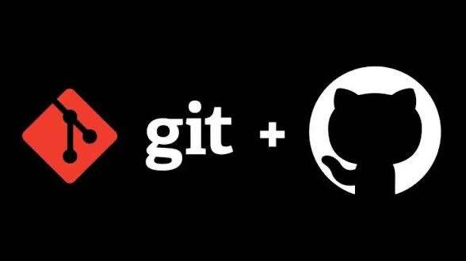

<h1 align="center"> Conceitos Fundamentais de Git e GitHub <br>
<p>
 <br>


</p>
</h1>

# 1. Diferença entre <mark style="background-color: orange">Git</mark> e <mark style="background-color: lightblue">GitHub</mark>

## O que é <mark style="background-color: orange">Git</mark>?

O <mark style="background-color: orange">Git</mark> é um **sistema de controle de versão distribuído** criado por **Linus Torvalds em 2005**. Ele foi desenvolvido para ajudar programadores a **registrar, organizar e acompanhar todas as mudanças feitas em um projeto de software ao longo do tempo**.

Com o <mark style="background-color: orange">Git</mark>, cada alteração feita em arquivos pode ser salva no histórico do projeto. Isso permite que desenvolvedores acompanhem a evolução do código e revertam mudanças caso algo dê errado.

Com o <mark style="background-color: orange">Git</mark>, é possível:

- registrar todas as alterações feitas no código;
- voltar para versões anteriores do projeto;
- criar versões diferentes do mesmo projeto para desenvolver novas funcionalidades;
- trabalhar em equipe sem sobrescrever o trabalho de outros desenvolvedores;
- manter um histórico completo de todo o desenvolvimento.

Uma das grandes vantagens do <mark style="background-color: orange">Git</mark> é que ele funciona **localmente no computador**, ou seja, mesmo sem conexão com a internet é possível utilizar praticamente todos os seus recursos.

### Características do <mark style="background-color: orange">Git</mark>

- sistema de controle de versão distribuído;
- histórico completo de todas as alterações;
- alto desempenho mesmo em projetos grandes;
- sistema de ramificação (branches) muito eficiente;
- permite colaboração entre vários desenvolvedores.

---

## O que é <mark style="background-color: lightblue">GitHub</mark>?

O <mark style="background-color: lightblue">GitHub</mark> é uma **plataforma online que hospeda repositórios do <mark style="background-color: orange">Git</mark> na nuvem**. Ele permite que desenvolvedores armazenem seus projetos na internet e colaborem com outras pessoas de forma organizada.

Enquanto o <mark style="background-color: orange">Git</mark> controla as versões do código localmente, o <mark style="background-color: lightblue">GitHub</mark> funciona como um **serviço online que guarda esses projetos e facilita o trabalho em equipe**.

Além de armazenar código, o <mark style="background-color: lightblue">GitHub</mark> oferece várias ferramentas importantes para o desenvolvimento colaborativo, como:

- controle de **issues** (tarefas, melhorias e problemas do projeto);
- **pull requests**, usados para sugerir mudanças no código;
- revisão de código entre desenvolvedores;
- gerenciamento de projetos e organização de tarefas;
- integração com ferramentas de automação e desenvolvimento.

### Principais vantagens do <mark style="background-color: lightblue">GitHub</mark>

- armazenamento de projetos na nuvem;
- colaboração entre desenvolvedores;
- controle de versões online utilizando <mark style="background-color: orange">Git</mark>;
- facilidade para compartilhar código;
- integração com diversas ferramentas de desenvolvimento.

---

## Diferença resumida

| <mark style="background-color: orange">Git</mark> | <mark style="background-color: lightblue">GitHub</mark> |
|----|----|
| Ferramenta de controle de versão | Plataforma de hospedagem |
| Funciona localmente | Funciona na internet |
| Controla o histórico do código | Armazena e compartilha projetos |
| Pode ser usado sem internet | Requer internet |

📌 **Resumo**

O <mark style="background-color: orange">Git</mark> é a **ferramenta que controla as versões do código**, registra alterações e organiza o histórico do projeto.

O <mark style="background-color: lightblue">GitHub</mark> é a **plataforma online que hospeda repositórios do <mark style="background-color: orange">Git</mark>**, permitindo compartilhar projetos e colaborar com outros desenvolvedores.

<br>

# 2. <mark style="background-color: lightgreen">Commits</mark>

Um <mark style="background-color: lightgreen">commit</mark> é um registro permanente das alterações feitas em um projeto controlado pelo <mark style="background-color: orange">Git</mark>.

Sempre que um desenvolvedor modifica arquivos e deseja salvar essas mudanças no histórico do projeto, ele cria um <mark style="background-color: lightgreen">commit</mark>. Dessa forma, cada modificação importante fica registrada e pode ser consultada no futuro.

Cada <mark style="background-color: lightgreen">commit</mark> contém informações importantes sobre a alteração realizada, como:

- alterações realizadas nos arquivos;
- nome do autor que fez a modificação;
- data e hora em que a alteração foi registrada;
- mensagem descrevendo o que foi alterado.

Esse processo cria um **histórico completo do projeto**, permitindo acompanhar toda a evolução do desenvolvimento ao longo do tempo utilizando o <mark style="background-color: orange">Git</mark>.

---

## Fluxo básico de <mark style="background-color: lightgreen">Commits</mark>

Normalmente o processo de criação de um <mark style="background-color: lightgreen">commit</mark> no <mark style="background-color: orange">Git</mark> ocorre em três etapas:

1. modificar arquivos do projeto;
2. adicionar arquivos ao estágio de preparação (stage);
3. registrar as alterações criando um <mark style="background-color: lightgreen">commit</mark>.

### Exemplo de comandos

```bash
git add .
git commit -m "Adiciona página inicial do site"
```

Nesse exemplo:

- "git add ." adiciona todos os arquivos modificados para a área de preparação;
- "git commit" registra definitivamente as alterações no histórico do <mark style="background-color: orange">Git</mark>.

Importância dos <mark style="background-color: lightgreen">Commits</mark>

Os <mark style="background-color: lightgreen">commits</mark> são fundamentais no controle de versão porque permitem:

- acompanhar a evolução do projeto ao longo do tempo;
- entender quando e por que uma alteração foi feita;
- restaurar versões anteriores do código;
- facilitar o trabalho em equipe entre vários desenvolvedores que utilizam <mark style="background-color: orange">Git</mark> e plataformas como <mark style="background-color: lightblue">GitHub</mark>.

## 📌 Resumo:
Os <mark style="background-color: lightgreen">commits</mark> funcionam como pontos de salvamento no histórico do projeto, registrando cada mudança feita no código dentro do <mark style="background-color: orange">Git</mark> e permitindo compartilhar essas alterações em plataformas como <mark style="background-color: lightblue">GitHub</mark>.

<br>

# 3. <mark style="background-color: pink">Branches</mark>

Uma <mark style="background-color: pink">branch</mark> (ramificação) é uma **linha de desenvolvimento independente** dentro de um projeto controlado pelo <mark style="background-color: orange">Git</mark>.

Ela permite que desenvolvedores trabalhem em **novas funcionalidades, correções ou experimentos** sem modificar diretamente o código principal do projeto.

Por padrão, todo repositório criado no <mark style="background-color: orange">Git</mark> possui uma <mark style="background-color: pink">branch</mark> principal chamada **main** (antigamente chamada **master**).  
Essa <mark style="background-color: pink">branch</mark> geralmente contém a **versão estável do projeto**.

Quando um desenvolvedor precisa criar uma nova funcionalidade ou corrigir um erro, ele pode criar uma nova <mark style="background-color: pink">branch</mark> para trabalhar separadamente, sem afetar o código principal.

---

## Criação de <mark style="background-color: pink">Branches</mark>

Exemplo de criação de uma nova <mark style="background-color: pink">branch</mark> no <mark style="background-color: orange">Git</mark>:

```bash
git branch nova-funcionalidade
git checkout nova-funcionalidade
```

Nesse exemplo:

- git branch cria uma nova <mark style="background-color: pink">branch</mark>;
- git checkout muda o ambiente de trabalho para essa nova <mark style="background-color: pink">branch</mark>.

### Forma mais moderna
Hoje é comum usar um único comando para criar e mudar para a nova <mark style="background-color: pink">branch</mark> ao mesmo tempo:
```bash
git checkout -b nova-funcionalidade
```

Esse comando:
- cria a <mark style="background-color: pink">branch</mark>;
- muda imediatamente para ela.

## Vantagens das <mark style="background-color: pink">Branches</mark>

As <mark style="background-color: pink">branches</mark> são um dos recursos mais importantes do <mark style="background-color: orange">Git</mark>, pois permitem:

- desenvolver funcionalidades separadamente;
- testar mudanças sem afetar o projeto principal;
- facilitar o trabalho em equipe;
- organizar melhor o processo de desenvolvimento.

## 📌 Resumo
As <mark style="background-color: pink">branches</mark> permitem criar linhas paralelas de desenvolvimento, possibilitando que diferentes partes do projeto sejam desenvolvidas ao mesmo tempo utilizando o <mark style="background-color: orange">Git</mark> e posteriormente compartilhadas em plataformas como <mark style="background-color: lightblue">GitHub</mark>.

<br>

# 4. <mark style="background-color: cyan">Merge</mark>

O <mark style="background-color: cyan">merge</mark> é o processo de **unir duas <mark style="background-color: pink">branches</mark> diferentes** dentro de um projeto controlado pelo <mark style="background-color: orange">Git</mark>. Depois que uma funcionalidade desenvolvida em uma <mark style="background-color: pink">branch</mark> está pronta, ela pode ser integrada à <mark style="background-color: pink">branch</mark> principal utilizando o <mark style="background-color: cyan">merge</mark>. Esse processo permite que diferentes partes do projeto sejam desenvolvidas separadamente e depois combinadas em uma única versão do código.

## Exemplo de <mark style="background-color: cyan">Merge</mark>

```bash
git checkout main  
git merge nova-funcionalidade
```

Nesse processo:

- `git checkout main` faz o desenvolvedor voltar para a <mark style="background-color: pink">branch</mark> principal;
- `git merge nova-funcionalidade` integra as mudanças feitas na <mark style="background-color: pink">branch</mark> de funcionalidade.

Após o <mark style="background-color: cyan">merge</mark>, todas as alterações feitas na <mark style="background-color: pink">branch</mark> secundária passam a fazer parte da <mark style="background-color: pink">branch</mark> principal no <mark style="background-color: orange">Git</mark>.

## Conflitos de <mark style="background-color: cyan">Merge</mark>

Em alguns casos, dois desenvolvedores podem modificar **a mesma parte do código em <mark style="background-color: pink">branches</mark> diferentes**. Quando isso acontece, ocorre um **conflito de <mark style="background-color: cyan">merge</mark>**.

Nesse momento, o <mark style="background-color: orange">Git</mark> não consegue decidir automaticamente qual versão do código deve permanecer e solicita que o desenvolvedor resolva o conflito manualmente.

O desenvolvedor precisa:

- analisar as duas versões do código;
- decidir qual alteração deve permanecer;
- finalizar o processo de <mark style="background-color: cyan">merge</mark>.

## 📌 **Resumo**

O <mark style="background-color: cyan">merge</mark> permite **unir diferentes <mark style="background-color: pink">branches</mark> de desenvolvimento**, integrando novas funcionalidades ao projeto principal controlado pelo <mark style="background-color: orange">Git</mark>.

<br>

# 5. <mark style="background-color: violet">Repositórios Remotos</mark>

Um <mark style="background-color: violet">repositório remoto</mark> é uma versão do projeto hospedada em um servidor online. Esses repositórios permitem que várias pessoas trabalhem no mesmo projeto e sincronizem suas alterações utilizando o <mark style="background-color: orange">Git</mark>.

Os serviços mais conhecidos de hospedagem de <mark style="background-color: violet">repositórios remotos</mark> são:

- <mark style="background-color: lightblue">GitHub</mark>
- GitLab
- Bitbucket

## Adicionando um <mark style="background-color: violet">Repositório Remoto</mark>

Exemplo:

```bash
git remote add origin https://github.com/usuario/projeto.git
```

Aqui:

- `origin` é o nome do <mark style="background-color: violet">repositório remoto</mark>;
- o link aponta para o projeto hospedado no <mark style="background-color: lightblue">GitHub</mark>.

## Enviando alterações para o <mark style="background-color: violet">Repositório Remoto</mark>

git push origin main

Esse comando envia os <mark style="background-color: lightgreen">commits</mark> locais para o <mark style="background-color: violet">repositório remoto</mark>.

## Baixando alterações do <mark style="background-color: violet">Repositório Remoto</mark>

```bash
git pull origin main
```

Esse comando atualiza o projeto local com as mudanças feitas no <mark style="background-color: violet">repositório remoto</mark>.


## 📌 **Resumo**
Os <mark style="background-color: violet">repositórios remotos</mark> permitem armazenar projetos na internet, facilitar a colaboração entre desenvolvedores e sincronizar alterações entre diferentes computadores utilizando o <mark style="background-color: orange">Git</mark> e plataformas como o <mark style="background-color: lightblue">GitHub</mark>.